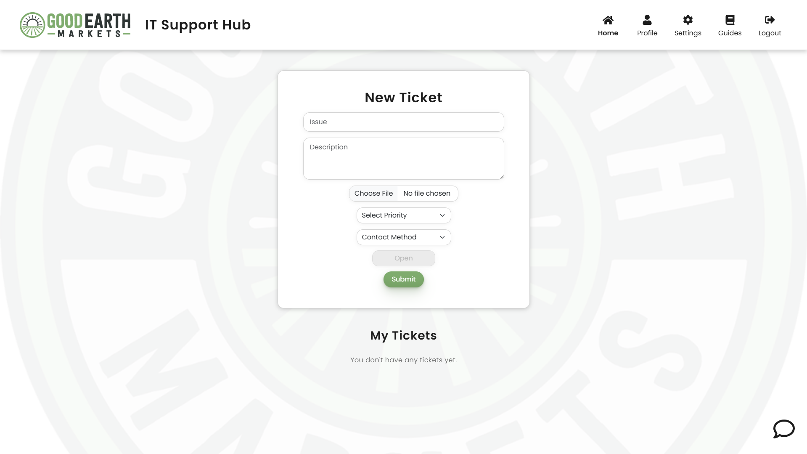
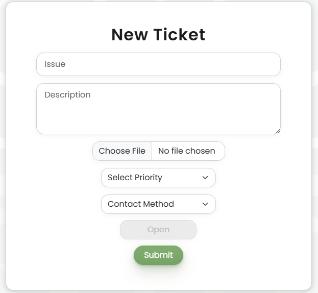
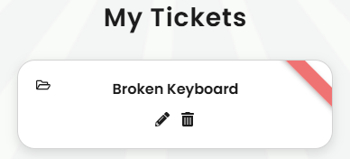

<!-- Improved compatibility of back to top link: See: https://github.com/othneildrew/Best-README-Template/pull/73 -->

<!--
*** Thanks for checking out the Best-README-Template. If you have a suggestion
*** that would make this better, please fork the repo and create a pull request
*** or simply open an issue with the tag "enhancement".
*** Don't forget to give the project a star!
*** Thanks again! Now go create something AMAZING! :D
-->

<!-- PROJECT SHIELDS -->
<!--
*** I'm using markdown "reference style" links for readability.
*** Reference links are enclosed in brackets [ ] instead of parentheses ( ).
*** See the bottom of this document for the declaration of the reference variables
*** for contributors-url, forks-url, etc. This is an optional, concise syntax you may use.
*** https://www.markdownguide.org/basic-syntax/#reference-style-links
-->

<!-- PROJECT LOGO -->
 

  

<h1 align="center" style="margin-bottom: 20px; border: none;">GEM IT Support Hub</h1>

<!-- ABOUT THE PROJECT -->
## About The Project

<h4>
This project was built to provide an IT Support Hub for Good Earth Market's employees. It allows users to create, view, update, and delete IT tickets. Integration with Google Chat allows users to create tickets via Chats, as well as receive notifcations about their ticket status.
</h4>

(<a href="#readme-top">back to top</a>)

### Built With

* ![Python][Python-url]
* ![Flask][Flask-url]
* ![JavaScript][JavaScript-url]
* [![React][React.js]][React-url]
* ![HTML5][HTML-url]
* [![Bootstrap][Bootstrap.com]][Bootstrap-url]
* ![MySQL][MySQL-url]

(<a href="#readme-top">back to top</a>)

<!-- GETTING STARTED -->
## Installation and Usage Guide

Visit this [walkthrough guide](https://docs.google.com/document/d/1h-FI6vS2Dqa3kiVD6-WFZw_xneOoyDguLT0r6YQ0uuo/edit?usp=sharing) for a thorough tutorial on installation and usage.

### Installation

1. Visit [the website](https://gemtickets.org)
2. Register for an account
3. Add the Google Chat App to your direct messages as shown in the [walkthrough guide](https://docs.google.com/document/d/1h-FI6vS2Dqa3kiVD6-WFZw_xneOoyDguLT0r6YQ0uuo/edit?usp=sharing)

(<a href="#readme-top">back to top</a>)

<!-- USAGE EXAMPLES -->
## Usage

Fill out the requested information for a new ticket, then hit submit.

  

You can view, update, or delete tickets in the 'My Tickets' section

  

Visit other pages to view your profile information, change your email/password, or view the troubleshooting guides! You can also view the IT teams contact information or submit feedback by clicking the chat button in the bottom right.

 

_For a thorough walkthrough, please refer to the [Guide](https://docs.google.com/document/d/1h-FI6vS2Dqa3kiVD6-WFZw_xneOoyDguLT0r6YQ0uuo/edit?usp=sharing)_

(<a href="#readme-top">back to top</a>)

### Creator: tchr7902

<!-- LICENSE -->
## License

Distributed under the MIT License. See `LICENSE.txt` for more information.

(<a href="#readme-top">back to top</a>)

<!-- CONTACT -->
## Contact

Trevor Christensen - trevorchristensen3405@gmail.com

Project Link: [https://github.com/tchr7902/ticketSystem](https://github.com/tchr7902/ticketSystem)

(<a href="#readme-top">back to top</a>)

<!-- MARKDOWN LINKS & IMAGES -->
<!-- https://www.markdownguide.org/basic-syntax/#reference-style-links -->
[contributors-shield]: https://img.shields.io/github/contributors/tchr7902/ticketSystem.svg?style=for-the-badge
[contributors-url]: https://github.com/tchr7902/ticketSystem/graphs/contributors
[forks-shield]: https://img.shields.io/github/forks/tchr7902/ticketSystem.svg?style=for-the-badge
[forks-url]: https://github.com/tchr7902/ticketSystem/network/members
[stars-shield]: https://img.shields.io/github/stars/tchr7902/ticketSystem.svg?style=for-the-badge
[stars-url]: https://github.com/tchr7902/ticketSystem/stargazers
[issues-shield]: https://img.shields.io/github/issues/tchr7902/ticketSystem.svg?style=for-the-badge
[issues-url]: https://github.com/tchr7902/ticketSystem/issues
[license-shield]: https://img.shields.io/github/license/tchr7902/ticketSystem.svg?style=for-the-badge
[license-url]: https://github.com/tchr7902/ticketSystem/blob/master/LICENSE.txt
[linkedin-shield]: https://img.shields.io/badge/-LinkedIn-black.svg?style=for-the-badge&logo=linkedin&colorB=555
[linkedin-url]: https://linkedin.com/in/trevorchristensen3405
[product-screenshot]: images/screenshot.png
[Next.js]: https://img.shields.io/badge/next.js-000000?style=for-the-badge&logo=nextdotjs&logoColor=white
[Next-url]: https://nextjs.org/
[React.js]: https://img.shields.io/badge/React-20232A?style=for-the-badge&logo=react&logoColor=61DAFB
[React-url]: https://reactjs.org/
[Python-url]: https://img.shields.io/badge/python-3670A0?style=for-the-badge&logo=python&logoColor=ffdd54
[JavaScript-url]: https://img.shields.io/badge/javascript-%23323330.svg?style=for-the-badge&logo=javascript&logoColor=%23F7DF1E
[Flask-url]: https://img.shields.io/badge/flask-%23000.svg?style=for-the-badge&logo=flask&logoColor=white
[Vue.js]: https://img.shields.io/badge/Vue.js-35495E?style=for-the-badge&logo=vuedotjs&logoColor=4FC08D
[Vue-url]: https://vuejs.org/
[Angular.io]: https://img.shields.io/badge/Angular-DD0031?style=for-the-badge&logo=angular&logoColor=white
[Angular-url]: https://angular.io/
[Svelte.dev]: https://img.shields.io/badge/Svelte-4A4A55?style=for-the-badge&logo=svelte&logoColor=FF3E00
[Svelte-url]: https://svelte.dev/
[Laravel.com]: https://img.shields.io/badge/Laravel-FF2D20?style=for-the-badge&logo=laravel&logoColor=white
[Laravel-url]: https://laravel.com
[Bootstrap.com]: https://img.shields.io/badge/Bootstrap-563D7C?style=for-the-badge&logo=bootstrap&logoColor=white
[Bootstrap-url]: https://getbootstrap.com
[JQuery.com]: https://img.shields.io/badge/jQuery-0769AD?style=for-the-badge&logo=jquery&logoColor=white
[JQuery-url]: https://jquery.com 
[HTML-url]: https://img.shields.io/badge/html5-%23E34F26.svg?style=for-the-badge&logo=html5&logoColor=white
[MySQL-url]: https://img.shields.io/badge/mysql-4479A1.svg?style=for-the-badge&logo=mysql&logoColor=white